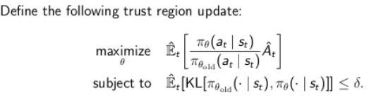
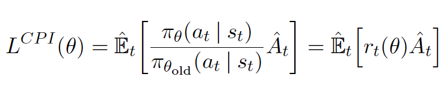
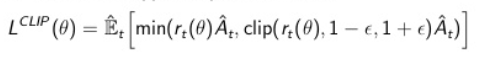
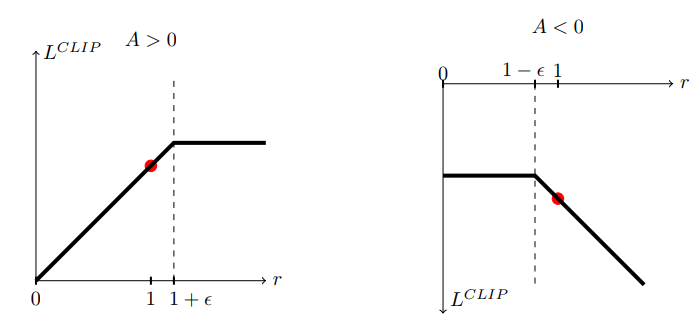

# PPO

1. one policy update as per sample
    - Sample data by interaction with environmnet
    - Optimize a surrogate objective function using SGA

---

### Why ppo
1. Benefits of TRPO, but simpler. more general, better complexity. It adds the constraint directly into our optimization problem.
2. Instead of solving TRPO using Conjugate gradient we can use stochastic gradient descent
3. Outperform other online policy gradient methods & overall strikes as a favorable balance between sample complexity and simplicity and wall time
    - Online policy: Agent can pick actions
    - Most obvious setup --- Learn with exploration but play without exploration
    - Agent follows his own policy --- Learn from either an expert -imperfect- or from recorded sessions -recorded data-
    - Agent creates its own data by interacting with the environment --- Leading to instability in the distribution of the observations & rewards
4. Since it is a policy based method, it does not find or approximate value function, but, it tries to find/optimize directly the policy

---

### PPO Goal
- RL is sensitive to Hyperparams tuning
- PPO goal: to perform comparably or better than the SOTA approaches while being much simpler to implement and tune
- Main Goals: 
    1. easy to code
    2. sample efficient
    3. Easy to tune the hyper parameters

- PPO does not use replay buffer - a buffer that stores transition and experience (s, a, r, s') like DQN, learns directly from whatever agent encounters.
- Once a batch of experience has been used to do gradient update the experience is then discarded and policy moves on; hence, policy gradient methods are typically less sampling efficient than Q-Learning because using collected experience once.
- General policy optimization method usually start with defining the policy gradient laws as the expectation over the log of policy actions multiplied by the estimate of advantage function.

    

    - policy πθ: it is a neural network takes the observed states from the environment as input and suggest actions to take as output.
    - A_hat: estimate of what the relative value of the selected action in the current state, to be calculated when need
        - discounted sum of rewards
            - We know all the rewards so there is no guessing involved in computing discounted sum of rewards (AKA return), we actually know what happened  
        - baseline estimate
            -  AKA Value function
            -  Observed Env State s >> Value fn NN >> V(S) estimate of discounted return from this point onwards
                - Since we mentioned a NN, then the value will be noisy
            -  Trying to guess what the final retun is going to be in this episode starting from the current state & during training this NN is going to be frequently updated using the experience that is collected by agent from environment becuase this is basically supervised learning (we have the state as input and we try to predict the estimate of return)
        -  A_hat = discounted sum of rewards -AKA return- (Computed) - baseline estimate (estimated using NN)
            - Retuns is basically we know what happened
            - Baseline answers the question what did we expect would happen
        - It answers the question how much better was the action that I took based on the expectation of what would normally happen in the state that I was in. Was the action better than expected or worse.
        - if it is +ve (better than average return) we will increase the probability of selecting them again in the future when we encounter the same state and vice versa.
- Not applying Gradient Descent on same batch as params in network will be update so far outside the range this data was collected, that advantage function -noisy estimate of the real adv- going to be completely wrong and so our policy will be destroyed. So, to fix that problem, we need to make sure that we are never going too far from policy -old policy- approach -> Trust Region Policy Optimizer [TRPO]

---

### Sneak peak on TRPO

- How does TRPO limits size of updates, by adding a constraint on size of policy update
    
    - the delta is the region size
    - it adds additional overhead to our optimization process, we are in region where our algorithm works fine sometimes. So, we need to vary our training behavior
- What PPO does is basically include this extra constraint directly into our optimization problem as well as using a linear approximation for both objective function, as well as, constrainted - thus avoiding conjugate gradient -
- Surrogate loss function of the TRPO (Conservative policy iteration loss function)

    
    - 0 < r(t) < 1: action is less likely now then it was before the last gradient step
    - r(t) > 1: action is more likely now that it was in the old version of the policy

---

### PPO & TRPO

- They are model free (update their own knowledge base not trying to estimate objective function using trail and error)
- Use advantage operatpr
- Continuous action & observation Space

---

### Algorithm

- it uses fixed length trajectory segments
- Each iteration for `K` epochs
    - each of `N` (parallel) actors collect `T` timesteps of data
    - Then we construct surrogate loss of these `NT` timesteps of data & optimize it with mini-batch SGD (or usually for better performance we use ADAM)
- loss function in PPO 

    
    
    - it is called surrogate objective function as it contains probability ratio betweem current and next policies
    - We use an expectation operator, as we update over batches of trajectory
    - `min(a, b)`, where
        - `a` is ratio of policy * advantage estimate: default objective for normal policy gradient which pushes policy towards actions that yield a high positive advantage fn over the baseline estimate 
        - `b` is the clipping of ratio for `1 + ε` and `1 - ε` -ε ∈ {0.1, 0.2, 0.3}-
        - the min allows us to undo a policy update if it was bad
        
        
        
        - on the right hand diagram, the action is less likely than the policy, after `1 - ε` we would undo the last update
        - on the left hand diagram, updating will stop at  `1 + ε` or else policy might get worse
        - quick reminder: since A_hat is noisy estimate so we do not want to destroy our policy based on a single estimate; hence, we use clipping
- PPO does not calculate all constraints or KL divergence hence it outperforms more complicated variants
   - Two alternating threads in PPO
       1. One current policy interacting with the environment generating episodes sequences for which we immediately calculate the advantage function using our fitted baseline estimate for state values
       2. Going to collect all the experiences and run gradient descent on policy network using the clipped PPO objective.
    - These 2 threads can be decoupled from each other using 1000s workers <remote> that interact with the environment using recent copy of the policy network and GPU cluster that runs gradient descent on network weights using collected experience.

---

## PPO Main Ideas

1. Clipped surrogate objective function
  - improve training stability by limiting change we make to the policy at each step
2. Multiple epochs for policy updating
  - Allows us to run multiple epochs of gradient ascent on our samples without causing destructively large policy updates
  - squeezes more data and reduce sample inefficiency
- PPo runs policy using `N` parallel actors each collecting data and then sample it mini batches to train for `K` epochs using clipped surrogate objective
    - `K` ranges between 3 - 15
    - `M` ranges between 64 - 4096
    - `T` (horizon) ranges between 128 - 2048

- Policy gradient methods do not make efficient use of data from old policy while avoiding challenges posed by importance sampling
- PG methods update rules should not change policy more than it was meant to >> Bounds
- Policy gradient methods are great for continuous and large space but they suffer from
    1. High variance >> Solution is to use actor critic models
    2. Delayed problems
    3. sample inefficiency
    4. learning rate highly affects training >> TRPO
        - TRPO adds constraint to our optimization problem to make sure updates are within the trust region, and this region varies
        - Trust region methods are pretty standard way to approach optimization problems.

---

## PPO Hyperparameters

1. `Epochs`
2. `Mini-batches`
3. `Horizon`

- The above 3 hyperparameters are experience collecting related
- PPO has 2 main steps
  1. Experiences/Transitions are gathered.
  2. Policy is improved
- But, there is no free lunch. We have 2 main issues
    1. How much experience the agent should gather before updating the policy
        - Agent collects experience horizon limits 
            -  `Horizon Range 32 - 5000`. Horizon n-steps, time horizon timesteps per actor batch
            -  `Mini batch Range 4 - 4096`
            -  `Epoch Range 3 - 30`
    2. How to actually update old policy to a new policy
        - PPO 
            - (KL) penalty version
                - `KL target range 0.003 to 0.03`
                - `KL init range 0.3 to 1.0` 
            - Clipping version, `ε ranges 0.1, 0.2, 0.3`
            - Discounting factor `γ ranges 0.8 to 0.9997`, most common 0.99
                - must balance with horizon
            - GAE parameter `λ ranges 0.9 - 1.0`
4. `Epochs Number`
5. `Optimizer Learning Rate ranges from 0.003 to 5exa(-6)`

  
