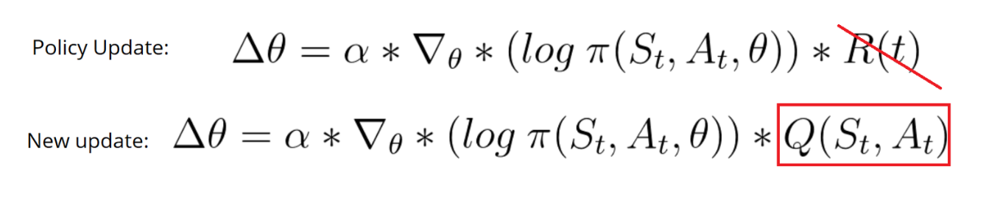
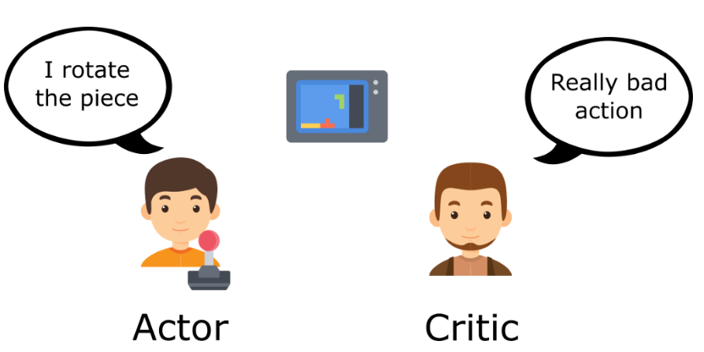
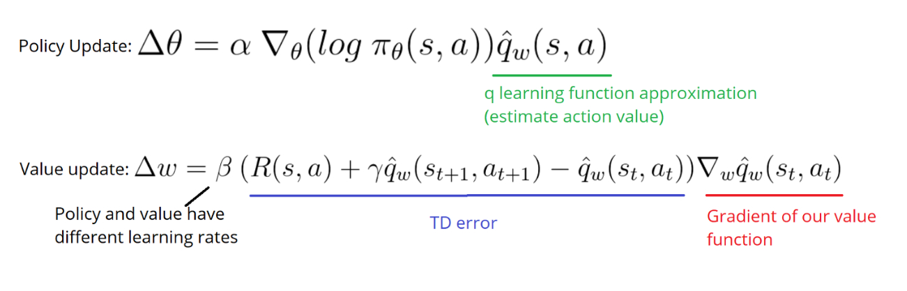
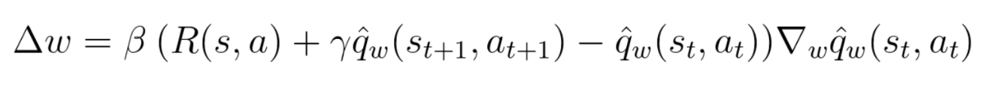
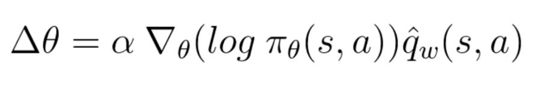
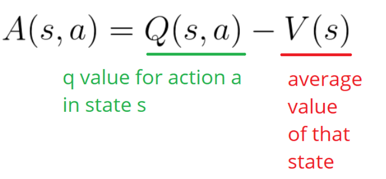
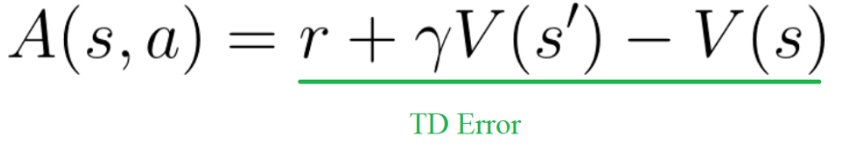

# ACTOR CRITIC

## Introduction

- The Policy Gradient method has a big problem. We are in a situation of Monte Carlo, waiting until the end of episode to calculate the reward. We may conclude that if we have a high reward (R(t)), all actions that we took were good, even if some were really bad. So, what if we can do an update each time step
- Actor Critic is a hybrid between value based and policy based methods
  - `Actor` is the part responsible with sampling our policy, and using this action to interact with the env - i.e. Controls how agent behaves. (POLICY BASED)
  - `Critic` is a measure of how good the action taken was. (VALUE BASED)
- Actor Critic has a better score function, and it follows the same approach as TD Learning

  

  - We can not use total rewards R(t), we need to train a critic model that approximates a value function

## How it works

- Basically, we have a human being playing a video game who acts on the environment, and a critic who observes the actions and provides a feedback
- at every iteration, the actor tries to improve his way of playing the game, and the critic tries to improve his way of criticizing so both gets better by time.
- Actor & Critic works in parallel
  - Actor >> controls how agent behave, so `π(s, a, θ)`
  - Critic >> measure how good the action was, so `q̂(s, a, w)`

## Implementation

- Both (Actor & Critic) are basically 2 neural networks we need to train and we need to set of weights one for each `(θ)` & `(w)`, respectively. And, both must be optimized separately.

  

- At each timestep `t`, we take current state `S``t` from the environment, and pass it as input through the actor critic networks
- policy takes the state and outputs an action `u``t` and receives a new state `S``t + 1` and reward `R``t + 1`
- In a nutshell,

  - Critic: Computes the value of taking that action at a given state
    - 
  - Actor: updates policy parameters using q values and produces new action `u``t + 1` when receives a new state `S``t + 1`
    - 

- Value based approaches have high variability, which is not favorable. So we introduce advantage function to stabilize the learning process.
  - Advantage function it basically tells us the improvement compared to the average action taken at the state.
    
  - if `A(s, a) > 0` gradient is pushed towards the direction that increases the policy, otherwise, pushed in the opposite direction
  - From the figure above we can note that to compute the advantage function we need to know our `Q(s, a)` and `V(s)`...
  - Fortunately enough, we can use TD error which is
    

### Strategies: A2C & A3C

- Advantage Actor Critic [A2C]: It is a synchronous method, where

  1. it waits for all agents to finish training
  2. Calculate their gradients to average them
  3. Use average to update the network

  - Unlike A3C, training is more cohesive, and faster.
  - It utilize the GPU more efficiently and work better with large batches achieving same or better performance compared to A3C
  - HOWEVER, it is not stable enough, so we turn our heads to [PPO](proximal-policy-optimizer.md)
    - PPO will improve the stability of the ACTOR training by limiting policy update at each training step, by using a new objective function called surrogate objective loss function

- Asynchronous Advantage Actor Critic [A3C]: It uses no experience relay
  - it executes different agents in parallel on multiple instances of the environment
  - However, some agents will be playing using older versions of params thus aggregating update will not optimal
  - It is good for 3D environments
