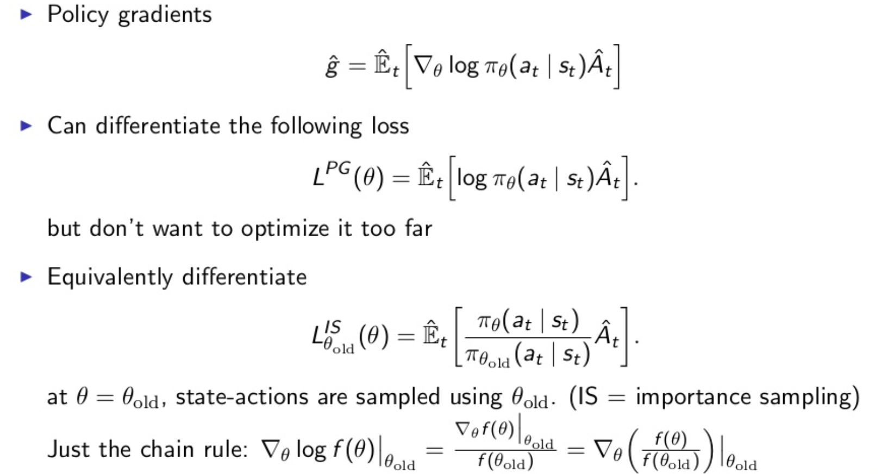

# Natural Policy Gradients

## Vanilla Policy Limitation

Vanilla Policy Gradient: it boils down to getting a policy gradient estimate and plugging it into stochastic gradient descent, however, there is more room for improvement by reducing variances for example, this is one thing, another is, once we compute the advantage estimate how do we update the policy.

But, let us start first with Vanilla PG limitations

1. Hard to choose a good step size that is going to work over the whole optimization process
   - due to the input data is not stationary; as policy changes observation and rewards distribution change.
   - can be addressed by normalization techniques but still is a problem
   - Bad step - in RL setup- is very damaging since it affects visitation distribution
     - Step too far >> bad policy
     - Next Batch >> Collected under bad policy
     - Can not recover >> Collapse in performance
2. Sample efficiency
   - UUse data to compute single gradient and discard it, thus, nit using all available information. i.e. only 1 gradient step per environment sample
   - dependent on scaling of coordinates

---

## RL problem reduced to optimization

- optimization problem that allows you to do a small update to policy `π` based on data sampled from `π` (on-policy data). Optimization is always done with minimization of a loss function, which is the policy gradient formula

- `Ê``t` is the empirical estimate expectation, in the policy gradient formula
- taking gradient of the loss function gives us the policy gradient formula
- Advantage estimate is noisy so we can not radically change our policy based on that
- The loss function is not a function to do many optimization iterations on. Because, then we are doing too big updates on the policy
- the loss function based on importance sampling is not so good; so we turn to KL penalizing method. which is [Trust Region Policy Optimization `TRPO`](trust-region-policy-optimization.md)

---
