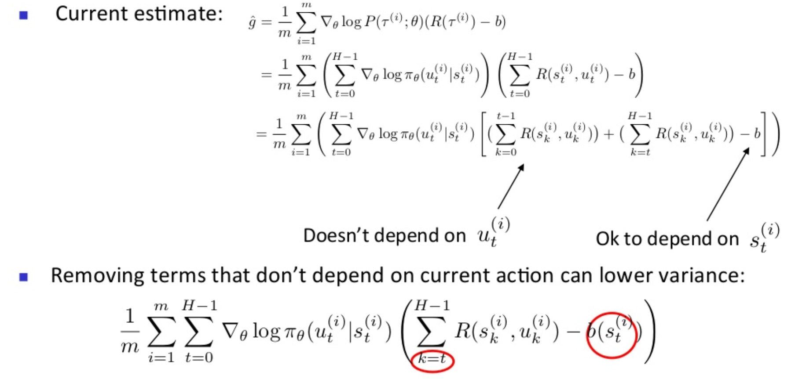

# Policy Gradient

## Introduction

Reinforcement Learning: falls under the umbrella of machine learning, it boils down to an agent acts in an environment to maximize its utility.

After the breakthroughs done by the Deep Learning[DL] in different variants of the machine learning, RL and DL are integrated together in what is called Deep Reinforcement Learning.

Falls under Deep Reinforcement Learning umbrella, we can find policy optimization methods, which is the parent of Policy Gradient methods, rather than Dynamic Programming methods which aim to satisfy value functions `V(s)` and Q-functions `Q(s, a)`.

So, what is the _goal of policy optimization_? basically, we want to find a stochastic policy `π``θ`, a `stochastic policy not a deterministic one?` Yes, because it smooths out the optimization problem.

But what is a **Policy**? It is a distribution over actions given state that maximizes the expected sum of rewards.

In Policy Optimization we assume that we found the policy -through search- using Q-function or value function, and we are optimizing the policy to do well.

In DRL we can think of a policy as a neural network, processes some information/state data through few layers then output a distribution over possible actions, that the agent might want to take. So, to act, our policy will sample an action that will change the environment - that we observe - and the process is repeated.

## What is the difference between policy optimization & Dynamic Programming?

1. `PO` focuses only on optimizing only what we care about. `DP` exploiting the problem structure and learn Q-function and update it
2. `PO` is more compatible with rich architecture, on the other hand, `DP` more compatible with exploration and off policy learning
3. `PO` is more versatile, `DP` more sample efficient when they work
4. `PO` is more compatible with auxiliary functions

## Math O'clock & Parametrization

Of course, after this intro, we would dive into the parametrization, so the weights in our NN are the `θ` vector, and this is our policy and since we are doing RL, we still want to maximize the expected sum of rewards

- assume that our discounting factor `γ = 1`, and of course, following the current policy

### BUT WHY POLICY OPTIMIZATION?

1. Policy focus on assets unlike `Q(s, a)` or `V(s)` as in any of them we need to know exactly numerically how much rewards are associated; hence, policy is simpler than both `Q(s, a)` or `V(s)`
2. Value function `V(s)`: it does not prescribe actions, we still need the transition model & system dynamics model to know what actions we should take in any given current state
3. Q-function `Q(s, a)`: very tricky in a high dimensional state, and fails in continuous environment.

### Policy Optimization is a gradient based method

So what gradient we will use? `Likelihood ratio policy gradient`

check the following for the derivation

> As Patrick H. Winston always say `Let the math, sing to you.`

Like everything in life, there is never an ideal world, so this method is valid only when

1. Reward function (`R(τ)`) is discontinuous or unknown
2. Sample space (of the paths) is discrete

But, what is better than understanding what does this method does on intuitional level

#### Intuition time

It basically updates the policy by looking at the probability of the paths (trajectory) produced by the current policy.

**Intuition time is over**

#### What is the path probability?

it is product of probabilities of the next state given the current state and action as encoded by system's dynamics model, multiplied by the probability of action given state under some policy, as we said, we need **NO** dynamics model, but what if I am not telling you the truth? I will show you that I have nothing up my sleeve

> and here is where the beauty lies, we don't need to know about our dynamics model only to the policy

and one more take-home-lesson, this is our neural net that encodes the distribution of our actions given a state, for each state we encountered & we can just backpropagate from beginning to get the derivations.

#### Another way to derive the above

Derivation from **Importance Sampling**

- But why? simply, because we don't want our policy updates to be big which might lead to catastrophic performance of our beloved agent.
- It is computing an expectation under some distribution namely when we use `π``θ`, we want to know what the expectation is but our samples, trajectories comes from the old policy `π``θ``old`.
- Sample from `π``θ``old`, results in trajectories which will be used to compute an expectation but we care about the new `θ`, thus we need a correction factor

in a high dimensional space and a lot of paths can happen, and if we computed expectations we might not visit all possible paths, but, we hope that NN representing the policy is able to generalize across states, can be used to estimate how good is the update rather than just trusting it. As well as, it can be used as a surrogate objective loss function.

There is no free lunch, it is unbiased, but, very noisy; due to the intractable number of large samples

How to improve it?

1. Baseline
2. Temporal Structure
3. Natural Gradient

#### Baseline

If all rollouts are positive, what will happen is we will try to increase the probability of all rollouts, but, as it is the case in everything some rollouts are definitely better than the others, so we need to decrease probability of the rollouts that are not the best. This will be done by averaging the rollouts to get a "baseline" to increase the probabilites of actions having value better than baseline and reduce the others.

The beauty is that this is still unbiased, reduced variance, and it does not depend on the probability of an action.

increasing the gradient log probability of an action, the agent took given a state & by how much assuming this is a positive quantity from the amount of rewards expected from that time onwards, is better than what the agent would get on average from current time onwards.

- but how to estimate the V(s)?

and use that in the policy gradient update method, Our goal here is to predict whatever rewards the agent will get after it was in that state.

Another approach is Monte Carlo estimate, which is more sample efficient

#### Temporal Structure

we have the current estimate, which we will decompose it to the sum of gradients for each timestep, multiply it by all the rewards which is also the sum of rewards over time.

Remove the terms that do not depend on current action, in order to lower the variance.

#### Vanilla Policy Gradient

to reduce variance even more

1. Discounting rewards
   

2. By function approximation (CRITIC)
   - Async Advanced Actor Critic (A3C) picks a specific set of lookaheads
     
   - GAE is exponential averaging averaging of all possible `k` choices
     
   - Actor Critic
     - It is running a policy gradient methods where we estimate a value function for our baseline.
     - Once we have the value function, actor critic changes to be Active Critic
   - Actor Critic with A3C or GAE:
     - Policy gradient + generalized advantage estimate
   - A3C performs better on `Atari` and provide really good results for continuous control compared to DQN in terms of how fast it converges; this is due to little bit built in of exploration over multiple machines.
   - GAE params are
     1. Discounting factor: `γ`
     2. Exponential decay: `λ`
        - brings a little bit of Temporal difference and reduces variance, but when we rely on TD a lot, model gets biased.

- But what is vanilla policy gradient? [Read this document for the answer](natural_policy_gradient.md)

---

## Acknowledgment time

Thank you Berkeley for this amazing Deep Reinforcement Learning boot camp, Take a look to [watch their playlist](https://www.youtube.com/channel/UCTgM-VlXKuylPrZ_YGAJHOw/videos)
