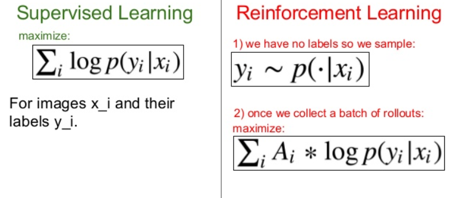
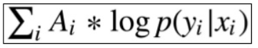

# Implementing PPO with pixels input

## Policy Network

- we have raw pixels as our input to the network -multi layer perceptron-, and it outputs a probability of action. per step
- per epoch, it takes in a set of states and outputs the best policy. the best stochastic policy -why? as we said earlier, as it allows exploration and optimization of the problem-

- We can brute force the learning approach however we need to save computations power and time; thus, we use policy gradient methods.
- A part of policy gradient methods, can be thought of as supervised learning where a state is given, best action. However, we do not have labels so we simply do reinforcement learning (explore the environment, try different actions, observe what happens and exploit them later) and increase the log probability of things that worked.

    

- TRPO makes sure tweaking our network hyperparameters will not change our distribution of our actions for each state too much, we prefer smoothness.
- We start random and upon stumbling into solutions increase the actions probability >> Continuously updating our distribution of our probability of actions, thus it is more and more rewarding
- Discounted rewards is a heuristic for modulating the blame - for actions - in time sensitive < which is not very good in theory but good in practical>. It decays exponentially

    

## Implementation in a very abstract manner

- Iterate until termination condition or convergence
  1. process observations
  2. Feedforward to the NN
  3. interact with env
  4. keep track of rewards, losses, states
  5. compute discounted rewards and advantage estimates
  6. Backpropagate the error
  7. perform the update for network params
