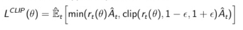
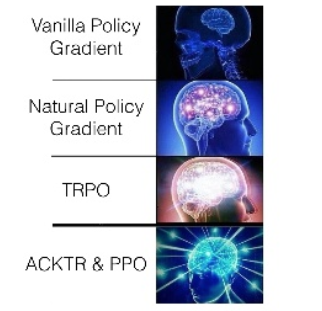

# Proximal Policy Optimizer [PPO]

## Motivation

- The problem with TRPO is that it uses conjugate gradient to solve the policy update problem
- Same performance as TRPO but with first order optimization
- TRPO is not compatible with architecture that produces multiple outputs
- TRPO performs poorly when integrated with CNNs and RNNs

## Introduction

- We are working on policy updating for best rewards same as TRPO but without conjugate gradient
- it has 2 forms:

  - KL Penalty version

    

  - Clipping objective function version

    - it is formed from two parts, the Importance sampling surrogate loss function
      
    - and lower bound theory used in TRPO, forming lower -pessimistic- bound which can be optimized by SGD
      

    - PPO Algorithm

      - implement vanilla policy gradient and use the clipped surrogate objective loss function for many steps of Gradient Descent instead of just one (better sample efficiency). As we deduce more info from our data and doing update that achieves kindly a reliable amount of KL divergence between `π``θ``old` and `π``θ`

      

---

## WRAP UP

