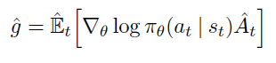
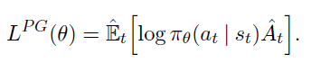
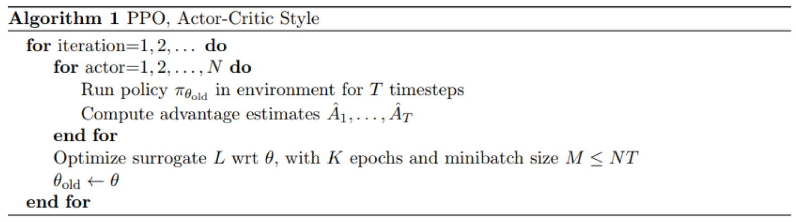

# Proximal Policy Optimizer [PPO]

It is a member of a new family of reinforcement learning methods known as [Policy Gradient methods](policy-optimization.md), which basically performs one policy update as per sample, however, PPO alternates between

1. Sampling data by interacting with the environment
2. Optimizing 'surrogate' objective function using stochastic gradient ascent.

### Why PPO?

1. It has some benefits of Trust Region Policy Optimization [TRPO], but much simpler (in terms of implementation), more general, and have better sample complexity.
2. It outperforms other online policy gradient methods, and overall strikes a favorable balance between sample complexity and simplicity, and wall-time.

---

### Few Notes I

- Online policy gradient methods are methods where
  1. Agents can pick actions on their own
  2. Follows most obvious setup
     1. Learn with exploration
     2. Play with exploitation
  3. Agent follows his own policy
     1. Learn from experts (Imperfect)
     2. Learn from recorded sessions (Recorded Data)

---

### Why not the other RL methods?

- Q-Learning with function approximation fails on many simple problems
- Vanilla policy gradient methods have poor data efficiency and robustness
- TRPO is relatively complicated and not compatible with architectures that include noise (such as dropout) or parameter sharing (between the policy and value function, or with auxiliary tasks).

> So we are trying to modify TRPO, by implementing an algorithm that attains its efficiency and reliable performance, but using 1st order optimization, which is the PPO.

To optimize policies, we need to alternate between sampling data from policy, and perform several epochs of optimization on the sampled data.

---

### Few notes II

- Agent creates its own data by interacting with the environment, which leads to instability in the distribution of observations and rewards.
- Note that reinforcement learning is sensitive to hyperparameters tuning

---

## PPO Goal

Is to perform comparably or better than state-of-the-art (SOTA) approaches **WHILE** being much simpler to implement.

### Main goals

1. Easy to code
2. Sample efficient
3. Easy to tune

### State-Of-The-Art (SOTA)

The PPO algorithm is mostly equivalent with TRPO algorithm. The difference is that it improves the current state of affairs by introducing an algorithm that attains the data efficiency and reliable performance of TRPO, while using only first-order optimization. Authors of the PPO

---

PPO does not use replay buffer like Deep Q Networks [DQN], it learns directly from whatever the agent encounters. Once a batch of experience has been used to do the gradient update step the experience is then discarded and policy moves on.

Hence, Policy gradient[PG] methods are typically less sampling efficient than Q-learning; as PG uses collection of experiences only once.

But what is `Replay Buffer`?

`Stores transition experience (state s, action a, reward r, new state s')`

---

## General Policy Optimization

General policy optimization methods usually start with defining the policy gradient laws as the expectation over the log of policy actions multiplied by the estimate of advantage function.

- The idea here is to push our agent to take actions leading to higher rewards and avoid bad actions

- **ĝ:** Estimator.
- **LPG(θ):** Policy Gradient Law.
- **Êt:** expected value.
- **πθ:** is the policy: neural network takes the observed states from the environment as an input & suggests actions to take as an output.
- **πθ(at|st):** policy actions.
- **∇θ:** gradient of log of policy actions w.r.t θ
- **Ât:** estimate of what the relative value of the selected action in the current state, estimate of the advantage function.

### To calculate **Ât:**

1. Discounted Sum of Rewards
   - [Return = k=0Σ∞ γk r t + k.]
   - Rewards the agent got so far
2. Baseline Estimate
   - AKA `Value Function`
   - Observed env state: `s` >> Value function of neural network >> `V(S)` = estimate of discounted return from now and onwards.
     - Basically, trying to guess what the final return is going to be in this episode starting from current state.
     - And, during, training this neural network is going to be frequency updated using the experience that is collected by agent from env; because, this is basically supervised learning.
       - Supervised learning: the state is the input and try to predict the estimate of the return as the output.
       - Hence this is a neural network, thus, the output will be noisy.

> **Ât = Return - Baseline Estimate**
>
> Return is computed (We know what happened) and baseline estimate is estimated using neural net (what did we expect would happen?)

- The **Ât** advantage estimate answers the following questions

  1. Was the action performed better than expected or worse
  2. How much better was the action that I took based on the expectation of what would normally happen in the state that I was in.

- So,

  log(πθ(at|st)) \* Ât = get final optimization objective that is used in policy gradient

- if (Ât > 0):

  - Better than the average return
  - we will increase the probability of selecting them again in the future when we encounter the same state again and vice versa.

---

### PPO Actor Critic Style

- Uses fixed length of trajectory segments
- Each iteration
  - each of `N` (parallel) actors collect `T` timesteps of data
- Then use constant surrogate loss of these `NT` timesteps of data & optimize it with minibatches using `SGD` (or usually better performance using Adam) for `k` epochs.

- Here we know all the rewards so there is no guessing involved in computing the discounted sum of rewards; as we actually know what happened.
