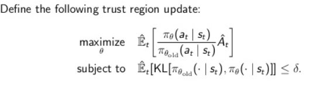
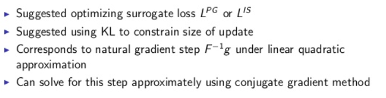

# Trust Region Policy Optimization [TRPO]

## Introduction

We are using this as we need to make sure our updates to the policy are not too big. How are we doing this?

- We have a function to optimize and some local approximation of this function which is accurate locally but goes inaccurate if we go far away from the starting point
- so we have a TRUST REGION where we TRUST our local approximator & as long as we are in this region, we are willing to optimize are local approximation a lot.

  

- TRPO boils down to constrained optimization problem.
- optimize the above equation, which is our local approximation subjected to the constraint that we are not moving too far away from the starting point.
- We have a lot of ways to define the constraint, one of them is computing KL divergence between old and new policy - by measuring the distance between probability distributions.
- WHY KL divergence?
  - Unitless
  - Limits update size unlike importance sampling
  - nice interpretation
- Why do not we use any distance method not KL divergence? As we are working with simple distributions
- Why we do not penalize instead of hard constraint? due to LaGrange multipliers both forms are equivalent
- Penalized form
  - 
  - theory result: max KL instead of mean in penalty so we get a lower bound on policy performance; thus more improvement from optimizing this lower bound.
  - 

### Algorithm Time

- Conjugate gradient: it is a numerical -non linear- optimization problem
  - repeatedly make approximation to function and solve the sub problem
  - It uses aggressive approximation
    1. Quadratic approximation to constraint
    2. Linear approximation to objective
- can be solved approximately
- Solving the KL constrained problem

  

- Solving the KL penalized problem

  

- Is not TRPO good enough? Actually NOPE. WHY??!! Because of the quadratic approximation done by the conjugate gradient method.
  - Thus, we need a linear approximator. Which can be found in [PPO](proximal-policy-gradient.md)

## Wrap up

- Wrapping up what we did here
  
- Connection between TRPO and other algorithms
  
- Limitations of TRPO
  - Conjugate Gradient complicates the implementation
  - TRPO is not compatible with architecture that produces multiple outputs. e.g. policy and value function
  - TRPO performs poorly when integrated with CNNs and RNNs
